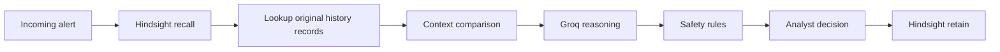

# Hindy — SOC Memory Agent

Hindy helps analysts investigate repetitive security alerts without treating a similar past case as automatic proof. Its core idea is simple: **memory found is not memory applies**. Every recalled case is checked against the current alert’s real context signals before it can influence the recommendation.

## Architecture



Hindsight stores 514 historical investigations with their original metadata and tags. Each incoming alert recalls relevant memories; the backend then looks up the original records and performs deterministic context comparison. Explicit analyst decisions create a live `<alert_id>-live` document only after Hindsight accepts the retain request. The live record is then saved locally in `data/analyst_overrides.json` for history lookup.

## Run locally

Create `.env` with these names only: `HINDSIGHT_API_KEY`, `HINDSIGHT_BANK_ID`, `HINDSIGHT_API_URL`, and `GROQ_API_KEY`.

```powershell
.\.venv\Scripts\Activate.ps1
python scripts\load_history.py --bulk
python scripts\warm_cache.py
python main.py
```

In another terminal:

```powershell
cd frontend
npm install
npm run dev
```

Build the replay view from saved results without model calls:

```powershell
python scripts\build_replay_cache.py
```

`python scripts\warm_replay.py` extends the recorded replay cache only when you explicitly choose to run it. It is sequential, resumable, paced at one request per three seconds, and records no classification for failures or quota exhaustion.

## Demo, replay, and evaluation

`results/demo_cache.json` stores recorded memory/no-memory analyses and suggested checks. “Demo mode: cached only” prevents Groq and Hindsight calls; missing entries report `Not recorded in demo cache`.

The Replay page reads `results/replay_cache.json`, a recorded agent run assembled from saved V2 memory results and demo cache entries. It does not create a learning curve or show labels not present in the recorded analysis.

The Evaluation page renders saved V1/V2 summaries only. Read the results with these caveats:

1. Measured on a synthetic dataset simulation, 94 replay alerts (10 attacks, 44 look-alikes, 40 benign, seed 42).
2. V2 rules were designed after analysing V1 failures on the same sample. This is not a held-out test.
3. V2 no-memory partly ran on smaller fallback models after the Groq quota ran out, so the memory vs no-memory comparison is confounded.
4. Memory-mode had more unnecessary escalations on benign alerts. The sample contains 57% dangerous alerts, so review load is not a real-world rate.

## Limits and safeguards

The alert data is synthetic and carries its own context signals. Results come from a small sample, and V2 rules were tuned on that sample. Memory can be poisoned by incorrect analyst input, so live decisions require an explicit analyst choice and reason, retain before local persistence, are tagged as live overrides, and can be reset without touching historical documents. A single live confirmation only caps at YELLOW; low risk needs at least two matching benign precedents. Hindy drafts investigation assistance and does not create external tickets.

## Screenshots to capture

Add these images under `docs/screenshots/`:

- Login
- Triage for `ALRT-00663` in RED
- Context diff
- Recalled memory cards
- Learning-pair before/after
- Replay
- Evaluation
